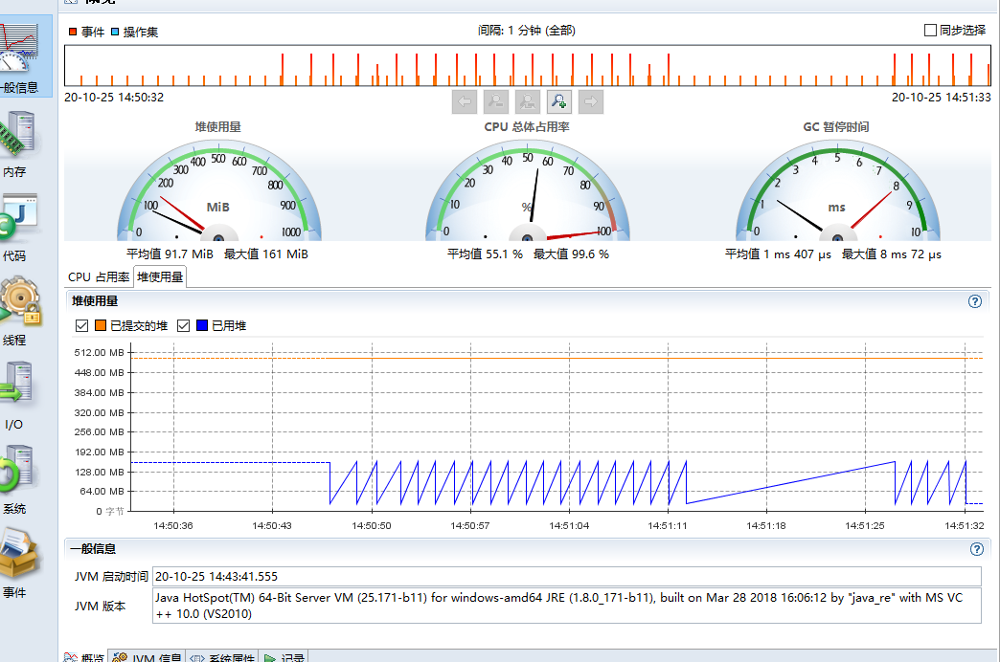
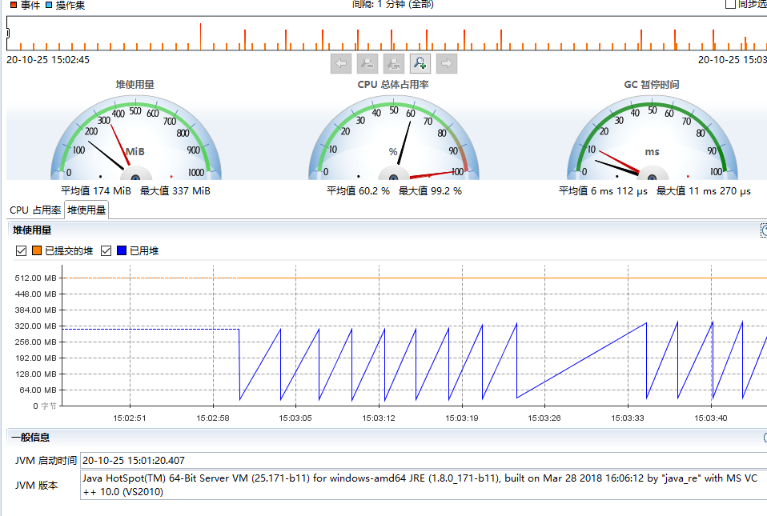
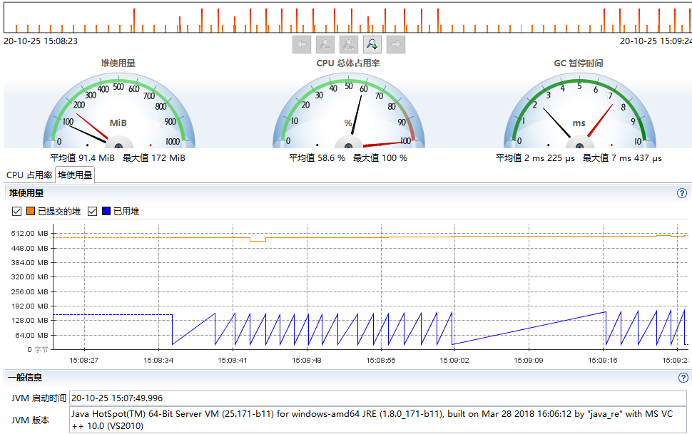

<a href="#title1">堆内存大小影响</a> <br/>
<a href="#title2">GC对性能的影响</a> <br/>
<a href="#title3">压测</a> <br/>


<h2 id="title1">堆内存大小影响</h2>

- case1 ubuntu16(win10) `java -Xmx128m-XX:+PrintGCDetails  GCLogAnalysis`
结果 : OOM
- case2 ubuntu16(win10) `java -Xmx256m-XX:+PrintGCDetails  GCLogAnalysis`
结果 : OOM
- case3 ubuntu16(win10) `java -Xmx512m-XX:+PrintGCDetails  GCLogAnalysis`
结果产生 5577 个对象
- case4 ubuntu16(win10) `java -Xmx1G-XX:+PrintGCDetails  GCLogAnalysis`
结果产生 5577 个对象
- ... 以下在增加内存对参数对象没有影响

<h2 id="title2">GC对性能的影响</h2>
java -XX:+UseSerialGC -Xms512m -Xmx512m -Xloggc:gc.demo.log -XX:+PrintGCDetails -XX:+PrintGCDateStamps GCLogAnalysis
java -Xms512m -Xmx512m -Xloggc:gc.demo.log -XX:+PrintGCDetails -XX:+PrintGCDateStamps GCLogAnalysis
java -XX:+UseConcMarkSweepGC -Xms512m -Xmx512m -Xloggc:gc.demo.log -XX:+PrintGCDetails -XX:+PrintGCDateStamps GCLogAnalysis
java -XX:+UseG1GC -Xms512m -Xmx512m -Xloggc:gc.demo.log -XX:+PrintGCDetails -XX:+PrintGCDateStamps GCLogAnalysis

观察 各个 GC 对于生成对象数来说: 区别不大

```aidl
2020-10-25T12:04:04.875+0800: [CMS-concurrent-mark-start]
2020-10-25T12:04:04.876+0800: [CMS-concurrent-mark: 0.001/0.001 secs] [Times: user=0.00 sys=0.00, real=0.00 secs]
2020-10-25T12:04:04.876+0800: [CMS-concurrent-preclean-start]
2020-10-25T12:04:04.877+0800: [CMS-concurrent-preclean: 0.000/0.000 secs] [Times: user=0.00 sys=0.00, real=0.01 secs]
2020-10-25T12:04:04.877+0800: [CMS-concurrent-abortable-preclean-start]
2020-10-25T12:04:04.890+0800: [GC (Allocation Failure) 2020-10-25T12:04:04.890+0800: [ParNew: 157245K->17469K(157248K), 0.0078250 secs] 446533K->351727K(506816K), 0.0080717 secs] [Times: user=0.00 sys=0.00, real=0.01 secs]
2020-10-25T12:04:04.898+0800: [CMS-concurrent-abortable-preclean: 0.000/0.021 secs] [Times: user=0.01 sys=0.00, real=0.02 secs]
2020-10-25T12:04:04.899+0800: [GC (CMS Final Remark) [YG occupancy: 23621 K (157248 K)]2020-10-25T12:04:04.899+0800: [Rescan (parallel) , 0.0003733 secs]2020-10-25T12:04:04.899+0800: [weak refs processing, 0.0001714 secs]2020-10-25T12:04:04.900+0800: [class unloading, 0.0002554 secs]2020-10-25T12:04:04.900+0800: [scrub symbol table, 0.0003248 secs]2020-10-25T12:04:04.900+0800: [scrub string table, 0.0002675 secs][1 CMS-remark: 334258K(349568K)] 357879K(506816K), 0.0018505 secs] [Times: user=0.00 sys=0.00, real=0.00 secs]
2020-10-25T12:04:04.901+0800: [CMS-concurrent-sweep-start]
2020-10-25T12:04:04.902+0800: [CMS-concurrent-sweep: 0.001/0.001 secs] [Times: user=0.03 sys=0.00, real=0.00 secs]
2020-10-25T12:04:04.902+0800: [CMS-concurrent-reset-start]
2020-10-25T12:04:04.903+0800: [CMS-concurrent-reset: 0.000/0.000 secs] [Times: user=0.00 sys=0.00, real=0.00 secs]
```

<h2 id="title3">使用压测工具（wrk或sb），演练gateway-server-0.0.1-SNAPSHOT.jar 示例</h2> 

- 使用CMS gc

- 使用G1 gc

- 使用并行GC



