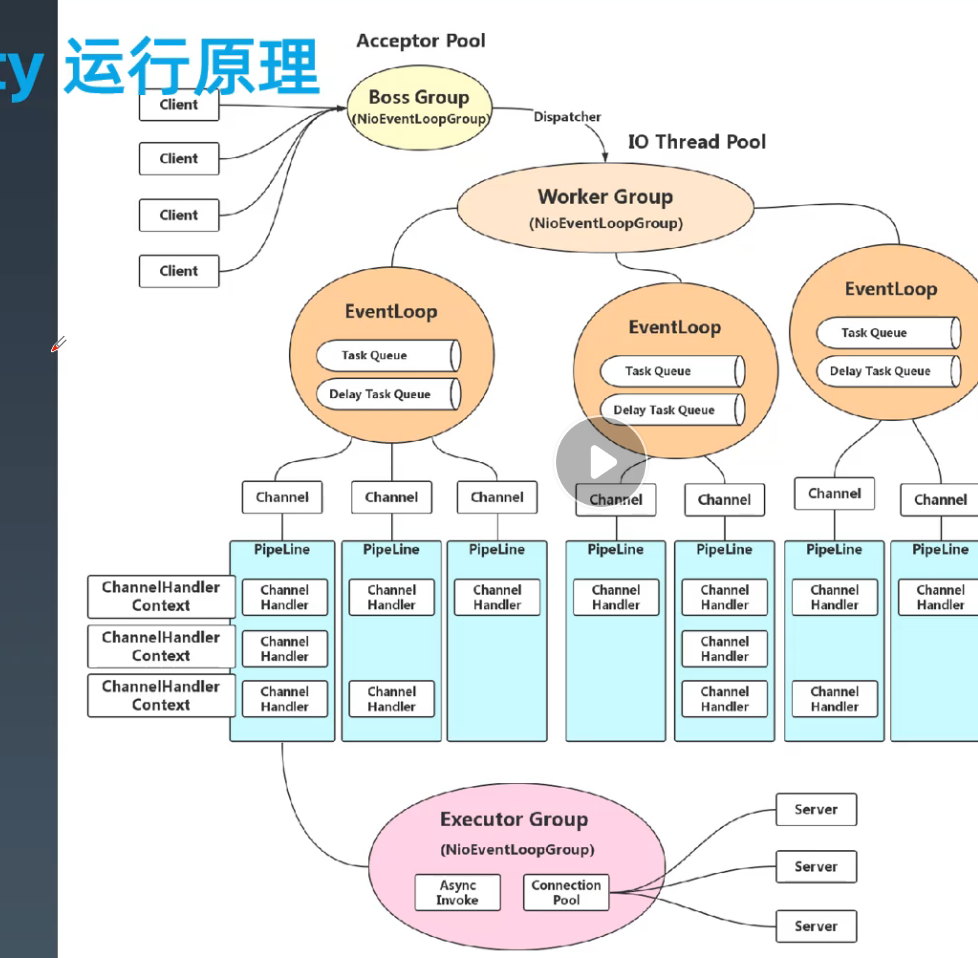

学习笔记

## 代码作业
Week_03 代码作业见 gateway

## 三次握手的 原因

第一次SYN,服务器知道客户端过来的网络是连通的，但客户端什么都不知道。
第二次ACK,客户端知道服务器回来的网络是连通的，推理得知本地到服务器的网络也是通的，但服务器不知道响应通道是否畅通。
第三次ACK,服务器知道两条链路都是畅通的。连接正式建立。
如果单边网络延迟200ms,那么创建连接的代价很高，连接池可能会非常必要。

##demo 
https: //github. com/dromara/soul

## 网关的作用

1. 流量网关 :Nginx
   1. 全局性流量控制
   2. 日志统计
   3. 防止sql注入
   4. 防止Web攻击
   5. 屏蔽工具扫描
   6. 黑白名单
   7. 证书/加解密
2. 业务网关
   1. 服务级别的流控
   2. 服务降级和熔断
   3. 路由与负载均衡,灰度策略


# Netty 模型
1. Reactor模型对应着 EventLoop
2. Netty 处理流程 BECH BossGroup(接受Socket)-> EventLoop(任务loop)->Channel(任务通道)->Handler(任务处理器)





## 作业


其中 的 路由 filter 为 : `RouterHttpRequestFilter` 
       key-value filter 为 : `NioHeaderFilter`
       HTTP请求 filter 为: `HttpClientAsyncRequestFilter()` 其中 构造方法可以 选择为`HttpClientExecutor` asynchttpclient |
       `Netty4ClientExecutor` Netty4Client
       

```java
public class HttpChannelInitializer extends ChannelInitializer {

    @Override
    protected void initChannel(Channel channel) throws Exception {
        ChannelPipeline pipeline = channel.pipeline();
        // 业务 handler 设置
        pipeline.addLast(new HttpResponseEncoder());
        pipeline.addLast(new HttpRequestDecoder());
        pipeline.addLast(new HttpObjectAggregator(1024 * 1024));
        pipeline.addLast(new HttpOutboundHandler(Arrays.asList(new DefaultHttpResponseFilter())));
       // pipeline.addLast(new HttpInboundHandler(Arrays.asList(new RouterHttpRequestFilter(new RandomRouter()), new NioHeaderFilter(), new HttpClientAsyncRequestFilter(new HttpClientExecutor()))));
        pipeline.addLast(new HttpInboundHandler(Arrays.asList(new RouterHttpRequestFilter(new RandomRouter()), new NioHeaderFilter(), new HttpClientAsyncRequestFilter(new Netty4ClientExecutor()))));
        pipeline.addLast(new LoggingHandler(LogLevel.INFO));
    }
}
```