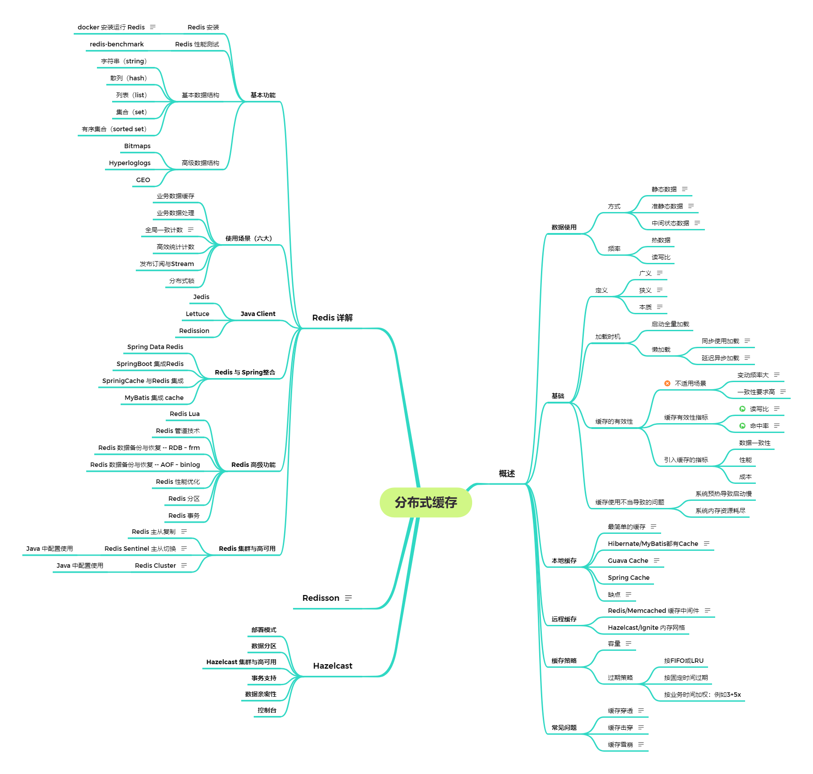

#### 第十一周：分布式缓存
- 分布式缓存技术
- Redis详解

#####Week11 作业题目：
1.（选做）命令行下练习操作 Redis 的各种基本数据结构和命令。

2.（选做）分别基于 jedis，RedisTemplate，Lettuce，Redission 实现 redis 基本操作的 demo，可以使用 spring-boot 集成上述工具。

3.（选做）spring 集成练习:
实现 update 方法，配合 @CachePut
实现 delete 方法，配合 @CacheEvict
将示例中的 spring 集成 Lettuce 改成 jedis 或 redisson

4.（必做）基于 Redis 封装分布式数据操作：
在 Java 中实现一个简单的分布式锁；
在 Java 中实现一个分布式计数器，模拟减库存。

5.（必做）基于 Redis 的 PubSub 实现订单异步处理

1.（挑战☆）基于其他各类场景，设计并在示例代码中实现简单 demo：

实现分数排名或者排行榜；
实现全局 ID 生成；
基于 Bitmap 实现 id 去重；
基于 HLL 实现点击量计数；
以 redis 作为数据库，模拟使用 lua 脚本实现前面课程的外汇交易事务。
2.（挑战☆☆）升级改造项目：

实现 guava cache 的 spring cache 适配；
替换 jackson 序列化为 fastjson 或者 fst，kryo；
对项目进行分析和性能调优。
3.（挑战☆☆☆）以 redis 作为基础实现上个模块的自定义 rpc 的注册中心。