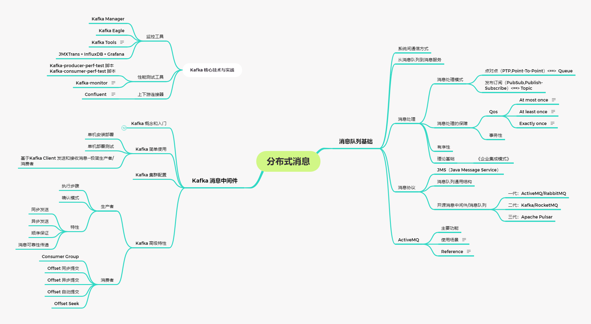

### 学习笔记
- 消息队列基础
- Kafka 消息中间件

### 作业
周四作业：
1.[（必做）搭建 ActiveMQ 服务，基于 JMS，写代码分别实现对于 queue 和 topic 的消息生产和消费，代码提交到 github。](https://github.com/qxf-Carl/JAVA-000/tree/main/Week_13/jsm-activemq)

2.（选做）基于数据库的订单表，模拟消息队列处理订单：

一个程序往表里写新订单，标记状态为未处理 (status=0);
另一个程序每隔 100ms 定时从表里读取所有 status=0 的订单，打印一下订单数据，然后改成完成 status=1；
（挑战☆）考虑失败重试策略，考虑多个消费程序如何协作。
3.（选做）将上述订单处理场景，改成使用 ActiveMQ 发送消息处理模式。

4.（选做）使用 java 代码，创建一个 ActiveMQ Broker Server，并测试它。

5.（挑战☆☆）搭建 ActiveMQ 的 network 集群和 master-slave 主从结构。

6.（挑战☆☆☆）基于 ActiveMQ 的 MQTT 实现简单的聊天功能或者 Android 消息推送。

7.（挑战☆）创建一个 RabbitMQ，用 Java 代码实现简单的 AMQP 协议操作。

8.（挑战☆☆）搭建 RabbitMQ 集群，重新实现前面的订单处理。

9.（挑战☆☆☆）使用 Apache Camel 打通上述 ActiveMQ 集群和 RabbitMQ 集群，实现所有写入到 ActiveMQ 上的一个队列 q24 的消息，自动转发到 RabbitMQ。

10.（挑战☆☆☆）压测 ActiveMQ 和 RabbitMQ 的性能。

周六作业：
1.[（必做）搭建一个 3 节点 Kafka 集群，测试功能和性能；实现 spring kafka 下对 kafka 集群的操作，将代码提交到 github。](https://github.com/qxf-Carl/JAVA-000/tree/main/Week_13/kafka)

2.（选做）安装 kafka-manager 工具，监控 kafka 集群状态。

3.（挑战☆）演练本课提及的各种生产者和消费者特性。

4.（挑战☆☆☆）Kafka 金融领域实战：在证券或者外汇、数字货币类金融核心交易系统里，对于订单的处理，大概可以分为收单、定序、撮合、清算等步骤。其中我们一般可以用 mq 来实现订单定序，然后将订单发送给撮合模块。

收单：请实现一个订单的 rest 接口，能够接收一个订单 Order 对象；
定序：将 Order 对象写入到 kafka 集群的 order.usd2cny 队列，要求数据有序并且不丢失；
撮合：模拟撮合程序（不需要实现撮合逻辑），从 kafka 获取 order 数据，并打印订单信息，要求可重放, 顺序消费, 消息仅处理一次。

Reference 
- [SpringBoot ActiveMQ Support](https://docs.spring.io/spring-boot/docs/2.4.1/reference/htmlsingle/#boot-features-activemq)
- [Docker 环境下搭建 Kafka 集群](https://blog.csdn.net/noaman_wgs/article/details/103757791)