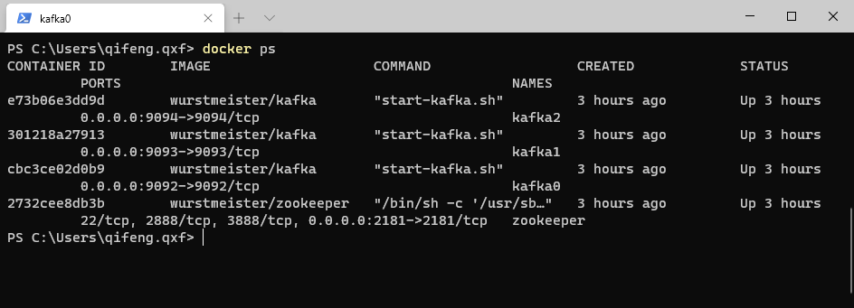
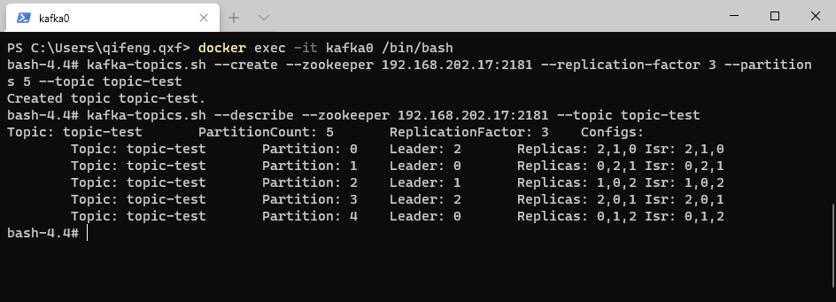
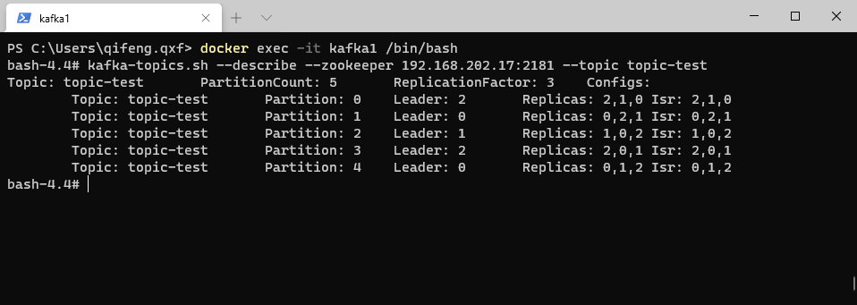
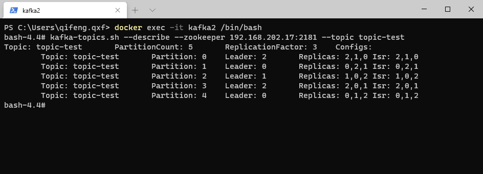
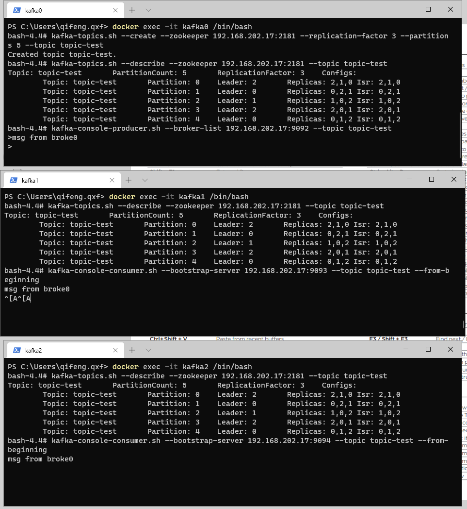
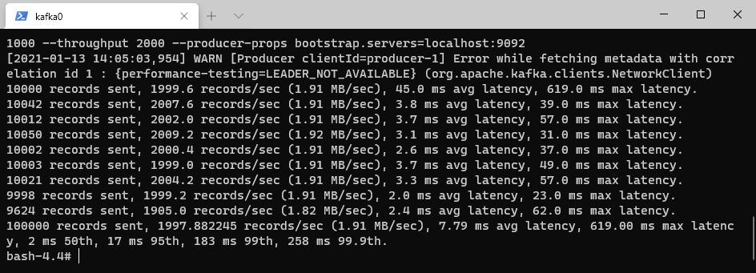
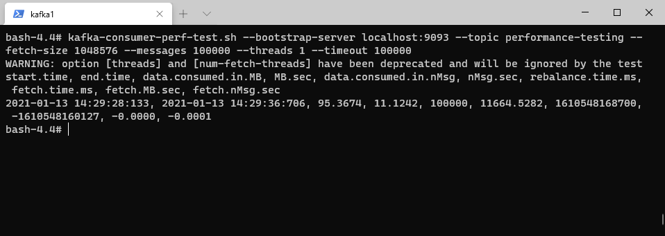

#### Project Introduction
（必做）搭建一个 3 节点 Kafka 集群，测试功能和性能；实现 spring kafka 下对 kafka 集群的操作，将代码提交到 github

#### docker run zookeeper
```
docker run -d --name zookeeper -p 2181:2181 wurstmeister/zookeeper
```

#### docker run kafka
```
docker run -d --name kafka0 -p 9092:9092 -e KAFKA_BROKER_ID=0 -e KAFKA_ZOOKEEPER_CONNECT=192.168.202.17:2181 -e KAFKA_ADVERTISED_LISTENERS=PLAINTEXT://192.168.202.17:9092 -e KAFKA_LISTENERS=PLAINTEXT://0.0.0.0:9092 -t wurstmeister/kafka
docker run -d --name kafka1 -p 9093:9093 -e KAFKA_BROKER_ID=1 -e KAFKA_ZOOKEEPER_CONNECT=192.168.202.17:2181 -e KAFKA_ADVERTISED_LISTENERS=PLAINTEXT://192.168.202.17:9093 -e KAFKA_LISTENERS=PLAINTEXT://0.0.0.0:9093 -t wurstmeister/kafka
docker run -d --name kafka2 -p 9094:9094 -e KAFKA_BROKER_ID=2 -e KAFKA_ZOOKEEPER_CONNECT=192.168.202.17:2181 -e KAFKA_ADVERTISED_LISTENERS=PLAINTEXT://192.168.202.17:9094 -e KAFKA_LISTENERS=PLAINTEXT://0.0.0.0:9094 -t wurstmeister/kafka
```



#### Test
1. 在Broker 0上创建一个副本为3，分区为5的topic用于测试。并
```
docker exec -it kafka0 /bin/bash
kafka-topics.sh --create --zookeeper 192.168.202.17:2181 --replication-factor 3 --partitions 5 --topic topic-test
```
2. 查看topic信息
```
docker exec -it kafka0 /bin/bash
kafka-topics.sh --describe --zookeeper 192.168.202.17:2181 --topic topic-test
```




3. Broker0上运行一个生产者，Broker1、2上分别运行一个消费者：
```
kafka-console-producer.sh --broker-list 192.168.202.17:9092 --topic topic-test
kafka-console-consumer.sh --bootstrap-server 192.168.202.17:9093 --topic topic-test --from-beginning
kafka-console-consumer.sh --bootstrap-server 192.168.202.17:9094 --topic topic-test --from-beginning
```


4. 性能测试
```
kafka-producer-perf-test.sh --topic performance-testing --num-records 100000 --record-size 1000 --throughput 2000 --producer-props bootstrap.servers=localhost:9092
kafka-consumer-perf-test.sh --bootstrap-server localhost:9093 --topic performance-testing --fetch-size 1048576 --messages 100000 --threads 1 --timeout 100000
```


#### Reference
 - [Docker 环境下搭建 Kafka 集群](https://blog.csdn.net/noaman_wgs/article/details/103757791)
 - [【Kafka精进系列003】Docker环境下搭建Kafka集群](https://blog.csdn.net/noaman_wgs/article/details/103757791)
